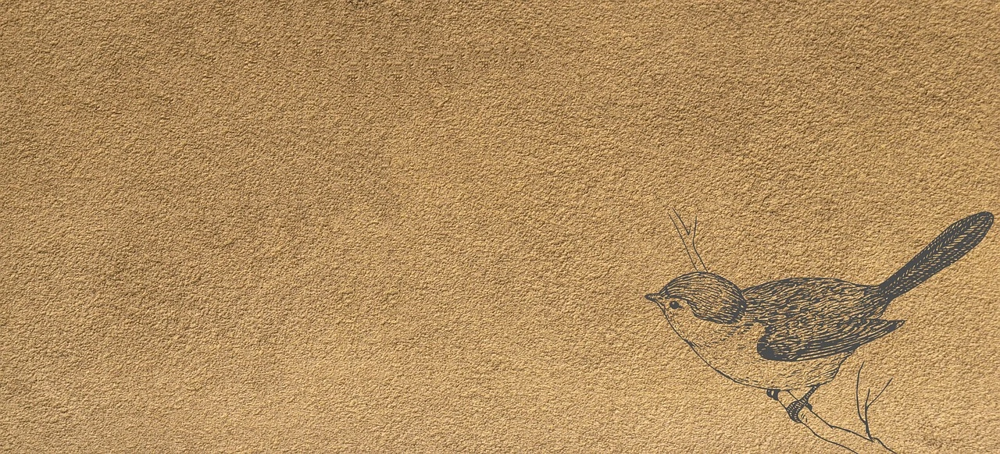

# Sobre mí

Soy desarrollador backend Python. Disfruto compartir mis conocimientos y opiniones, ya sea a través
de proyectos o explorando algunas ideas que me parezacan interesantes. Fuera de internet, me
apasiona el bicicross (BMX racing). También disfruto mucho de los c-dramas y las películas,
especialmente aquellas relacionadas con la ciencia ficción y la fantasía, dos de mis géneros
favoritos en el mundo del entretenimiento, ya sea en libros, series o cine.

Aunque gran parte de mis publicaciones estarán enfocadas en el desarrollo backend, también
compartiré mis opiniones sobre series, películas y algunos temas relacionados con la política,
que abordaré con seriedad y una perspectiva casi que diplomática aunque no soy un diplomatico.
Además, puede que escriba sobre mis actores o actrices favoritas de c-dramas, ya que disfruto mucho
del entretenimiento chino y su rica historia, aunque no la conozco en profundidad. Entre mis actrices
favoritas destacan Ju Jingyi y Liu Yifei, por mencionar solo a dos que me gustan mucho.

Con toda esta presentación sobre mí y los temas que abordo en este blog, espero que encuentren
contenido interesante, útil y entretenido. Mi objetivo es compartir conocimientos y algunas de mis
pasiones, confiando en que puedan ser de su agrado y, en algunos casos, de ayuda.

> Esta plantilla es gracias a:  [Fuwari](https://github.com/saicaca/fuwari).
